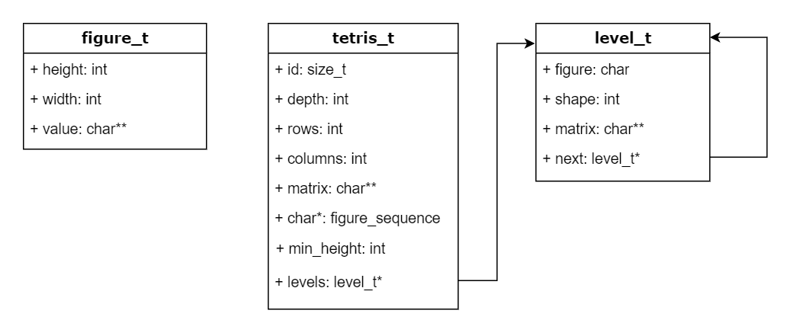
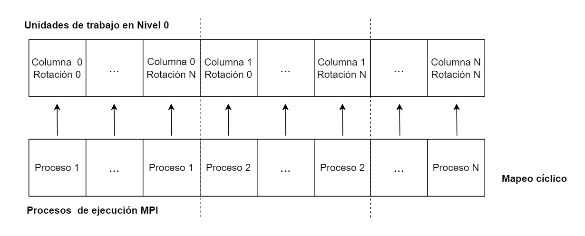
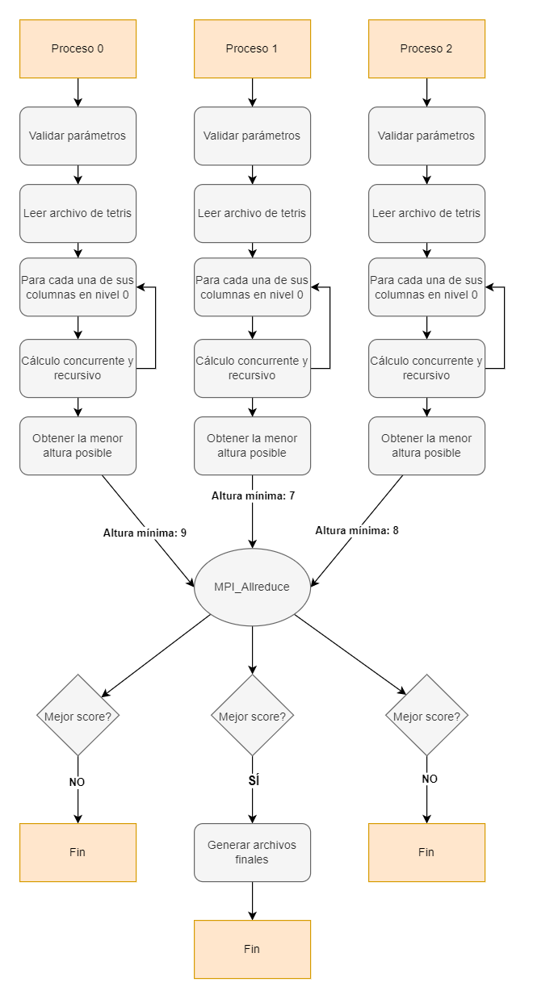
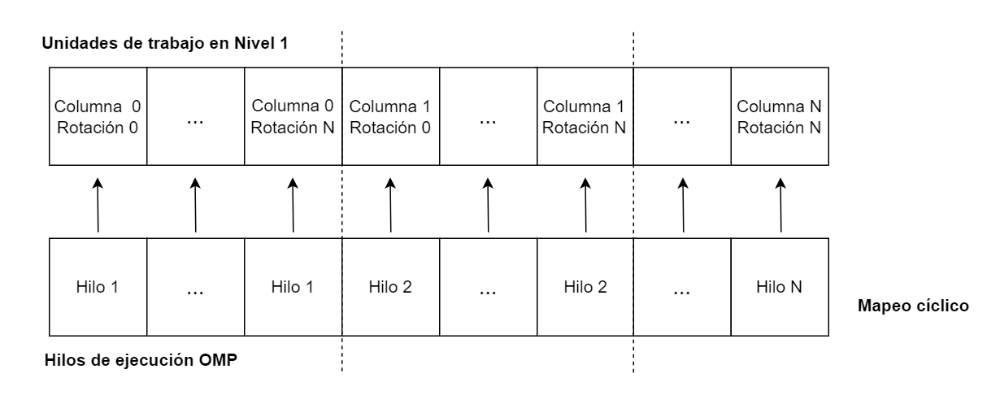

# Diseño
 
## Diagrama de la estructura de datos
El siguiente diagrama UML muestra el diseño de la estructura de datos realizada:



Como se puede apreciar, existen 3 estructuras de datos básicas que representan las figuras, el estado del tetris y una cola para manejar los niveles. La estructura de figuras no se relaciona directamente con el estado del tetris ni con los niveles, pero el estado del tetris sí tiene relación directa con la estructura de niveles mediante un puntero al nivel inicial o base cargado desde el archivo de entrada. Además, la estructura de niveles tiene una relación a sí misma ya que al funcionar como una cola cada nodo (nivel) se relaciona con el nodo que le sigue (siguiente nivel).


## Diagrama de repartición de trabajo entre procesos
La repartición del trabajo entre los procesos y/o nodos se realiza mediante un mapeo cíclico, donde cada proceso efectuará el cálculo de una columna específica y para cada rotación del nivel de profundidad 0. A su vez, cada proceso internamente realizará el cálculo del nivel 1 y posteriores niveles mediante el uso de **OpenMP**, tal como se explicará en la siguiente sección.

Este diagrama ejemplifica ese mapeo dinámico entre procesos:



La repartición entre procesos se puede lograr fácilmente con la tecnología **MPI**. Esta biblioteca ofrece muchas funciones nativas para enviar mensajes entre los procesos, coordinar entre ellos y realizar tareas de sincronización, que permiten implementar soluciones distribuidas de forma sencilla.

Para esta solución, cada proceso realiza el cálculo del mejor puntaje del tetris únicamente en las columnas del nivel 0 que le corresponden según el mapeo cíclico, y una vez que finalizan deben "comunicarse" de alguna forma para que puedan identificar cuál fue el mejor puntaje alcanzado entre todos los procesos y crear los archivos finales a partir de ese cálculo. Para ello se utilizó la función llamada `MPI_Allreduce` que hace que todos los procesos reciban los datos de los demás y apliquen sobre esos datos la operación `MPI_MIN` para que cada uno de ellos conozca cuál fue el mejor puntaje obtenido (en este caso corresponde a la altura mínima). Dado el escenario de que varios procesos hayan obtenido el mismo puntaje se vuelve a ejecutar la misma función, pero esta vez para conocer cuál proceso tiene el identificador más bajo (rank). Esto se realiza con el fin de seleccionar un único proceso que genere los archivos correspondientes a la mejor posición de las figuras en cada nivel y evitar así conflictos a la hora de que varios procesos intenten escribir sobre el mismo archivo.

Lo anterior se resume en el siguiente diagrama:




## Diagrama de repartición de trabajo entre hilos
La repartición del trabajo entre los hilos de ejecución se realiza a través de un mapeo cíclico, donde cada hilo efectuará el cálculo de una columna específica y para cada rotación del nivel 1. Cada unidad de trabajo corresponde a una columna del tablero y se recorrerá recursivamente cada posible jugada para calcular el mejor score según la profundidad definida. De forma cíclica, cada hilo tomará la siguiente columna que le corresponde según el tamaño del tablero. Esto se puede realizar en pocas líneas de código utilizando el constructo `omp parallel for ... schedule(static, 1)`.

En el siguiente diagrama se puede apreciar la repartición del trabajo entre los hilos:




## Descripción general
Esta solución se basa principalmente en la ejecución recursiva de una rutina que intenta encontrar una posición válida donde pueda colocar cada una de las piezas que "van cayendo", según la profundidad dada. Esto se realiza mediante fuerza bruta y a través de un algoritmo de Búsqueda en Profundidad (Depth First Search) que permite colocar todas las piezas de la secuencia en sus diferentes rotaciones y en diferentes posiciones para calcular el puntaje de la jugada en el nivel más abajo (hoja del árbol) con el fin de poder comparar dicho puntaje con el mejor puntaje que se tenga hasta el momento y poder así determinar si una jugada es mejor que la otra. En caso de haber encontrado una mejor jugada, se almacena en memoria la información del nivel bajo la estructura de una cola al insertar el nuevo nodo como un hijo o como el nodo siguiente del nivel actual, esto permite llevar el rastreo o tracking de la pieza colocada en cada nivel. El puntaje de las jugadas está basado en el cálculo de la altura mínima que tiene el tablero del tetris después de colocar una pieza.

Lo anterior es llevado a cabo de forma distribuida entre varios nodos/procesos a través de la tecnología **MPI** y de forma concurrente por varios hilos de ejecución implementados con la tecnología **OpenMP** que se reparten el trabajo según lo descrito anteriormente y de esa manera encontrar más rápido la mejor solución.

De forma general, estos son los pasos que ejecuta el programa principal:
1. Carga los parámetros recibidos y lee el archivo de entrada.
2. Carga el estado inicial del tetris: el identificador, la profundidad, el número de filas, el número de columnas, la matriz inicial, la cantidad de figuras siguientes y la secuencia de figuras.
3. Inicia el conteo del tiempo de ejecución.
4. Distribuye de forma cíclica a cada proceso las columnas del tablero en el nivel 0.
5. Mediante OpenMP se crean los hilos de ejecución y se reparten las unidades de trabajo (columnas en el nivel 1) de forma cíclica.
6. Inicia la ejecución de cada hilo que toma su unidad de trabajo correspondiente y ejecuta de forma recursiva el algoritmo principal DFS para solucionar el tetris.
7. Espera la finalización de todos los hilos para obtener el mejor puntaje del proceso.
8. Ejecuta un `MPI_Allreduce` para que todos los procesos sepan cuál fue el que mejor puntaje obtuvo.
9. El proceso con el mejor puntaje genera los archivos resultantes para cada uno de los niveles almacenados en la cola después de la ejecución. También calcula y muestra el tiempo tardado durante la ejecución.
10. Liberan toda la memoria correspondiente.
11. Finalizan la ejecución.


## Pseudocódigo
A continuación se muestra el pseudocódigo relacionado a la lógica distribuida:
```
main(argc, argv[]):
    if MPI_Init(&argc, &argv) == MPI_SUCCESS then
        rank := -1
        MPI_Comm_rank(MPI_COMM_WORLD, &rank)

        process_count := -1
        MPI_Comm_size(MPI_COMM_WORLD, &process_count)

        file_name := "./test/Test1.txt"
        thread_count = SC_NPROCESSORS_ONLN

        check_params(argc, argv[])

        file := open(file_name, "r")
        tetris := read_tetris(file)
        
        start_time := MPI_Wtime()
        solve_tetris_mpi(tetris, thread_count, rank, process_count)

        i_got_min := 0
        min_height
        MPI_Allreduce(tetris->min_height, min_height, 1, MPI_INT, MPI_MIN, MPI_COMM_WORLD)

        if tetris->min_height == min_height then
            min_rank
            MPI_Allreduce(rank, min_rank, 1, MPI_INT, MPI_MIN, MPI_COMM_WORLD);

            if rank == min_rank then
                i_got_min := 1
            end if
        end if

        if i_got_min == 1 then
            generate_files(tetris)

            finish_time = MPI_Wtime()
            print("Tiempo de ejecución:  ", start_time - finish_time)
        end if       

        MPI_Finalize();
    end if

solve_tetris_mpi(tetris, thread_count, rank, process_count):
    num_rotations := get_tetris_figure_num_rotations(tetris.figure_sequence[0])

    for col := rank to tetris->columns, col += process_count do
        for rotation := 0 to num_rotations do
            figure := get_tetris_figure(tetris.figure_sequence[0], rotation)
            place_figure(tetris, figure, col)

            level = create_level(tetris)
            tetris.levels.next := level

            solve_tetris_omp(tetris, thread_count)
        end for
    end for

solve_tetris_omp(tetris, thread_count):
    num_rotations := get_tetris_figure_num_rotations(tetris.figure_sequence[1])

    #pragma omp parallel for num_threads(thread_count) shared(tetris, num_rotations) schedule(static, 1)
    for col := thread_number to tetris->columns do
        for rotation := 0 to num_rotations do
            figure := get_tetris_figure(tetris.figure_sequence[1], rotation)
            place_figure(tetris, figure, col)

            level = create_level(tetris)
            tetris.levels.next := level

            solve_tetris_dfs(tetris, 1, tetris->levels)

            current_height := calculate_height()
            if current_height < tetris.min_height then
                tetris.min_height := current_height
                tetris.levels := clone_level(tetris)
            end if
        end for
    end for
```