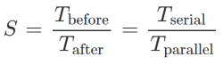
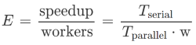
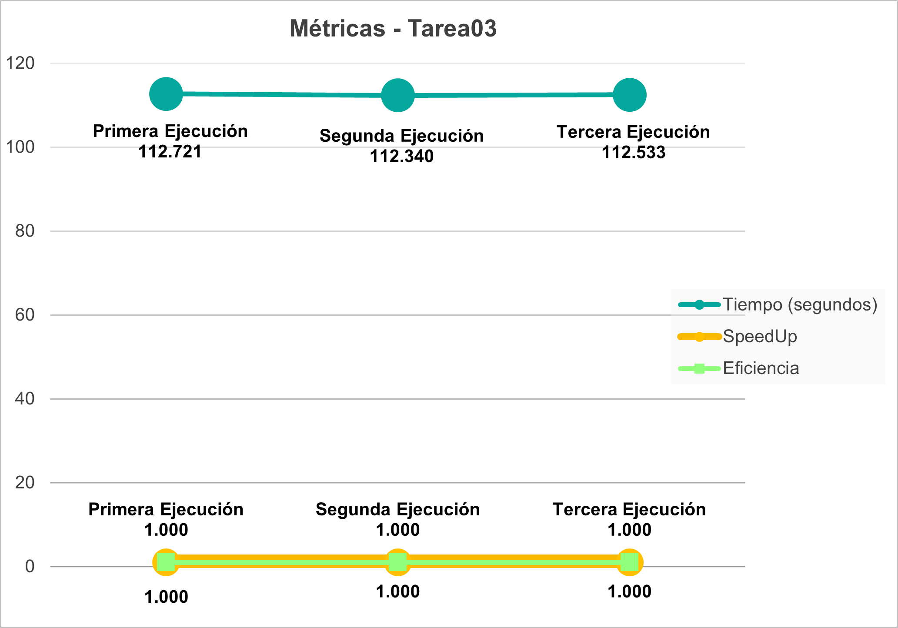
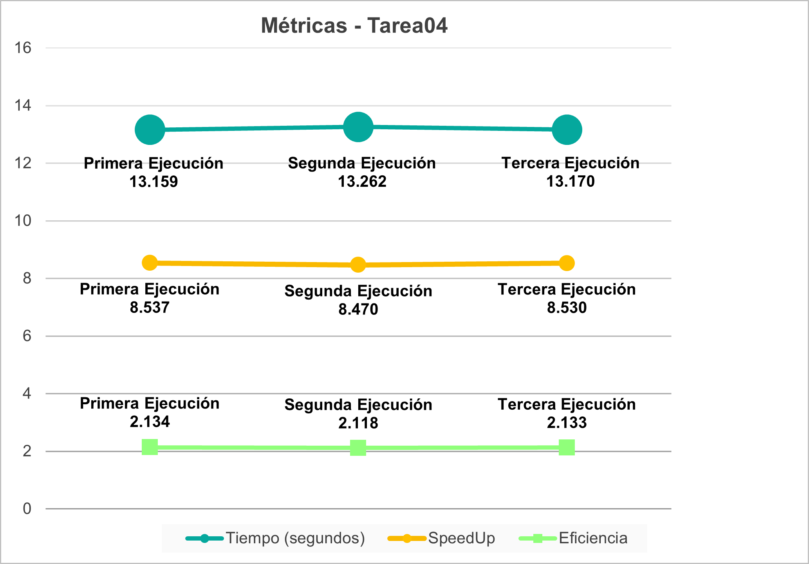
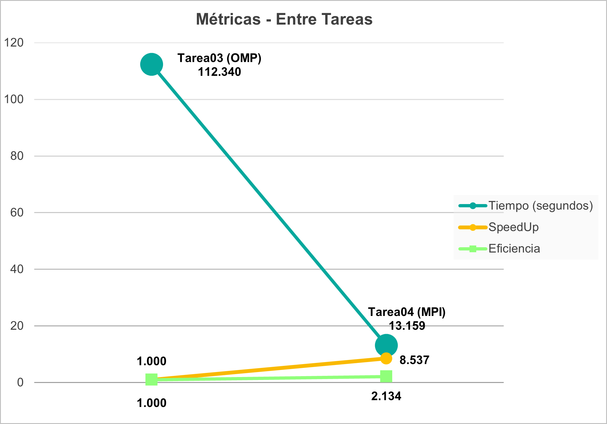
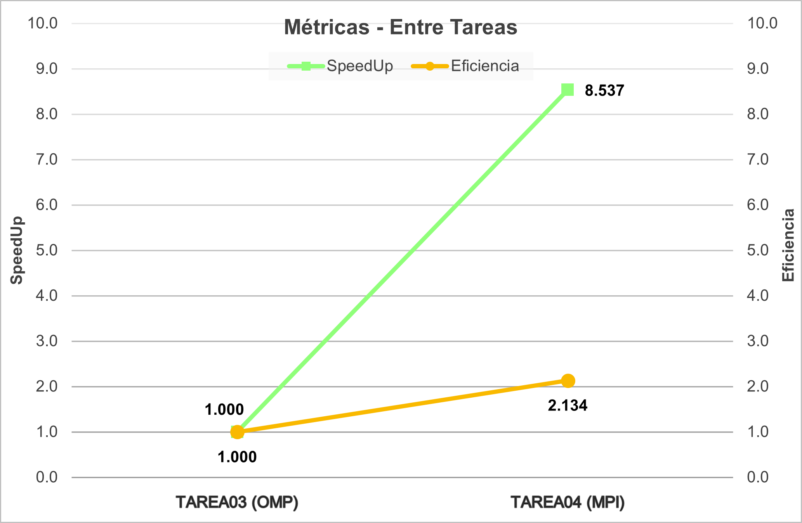

# Documento de reporte
Se realizaron algunas mediciones del tiempo que tarda la [Tarea03](../../tetris_solver_omp/) y [Tarea04](../../tetris_solver_mpi/) en ejecutar la parte más pesada del programa que es el cálculo de las mejores jugadas a través del algoritmo de DFS. Esto con el objetivo de realizar comparaciones entre ellas y ver si se logró mejoras en su rendimiento. Para calcular ese tiempo de ejecución se utilizó en la Tarea03 la rutina `omp_get_wtime()` de **OpenMP**, mientras que en la Tarea04 se utilizó la función `MPI_Wtime()` de la biblioteca **MPI**.

Para realizar esa medición se utilizó el archivo `Test4.txt` que se encuentra en el folder `/test`, el cual corresponde a un estado de tetris inicial con una profundidad de 10, con 20 filas y 10 columnas. Ese mismo archivo fue el utilizado en las pruebas de la Tarea03.

Todas las pruebas se llevaron a cabo en el [Clúster Kabré](https://kabre.cenat.ac.cr/) bajo la partición **NU** que está compuesta de 32 nodos Intel Xeon Phi KNL, cada uno con 64 núcleos a 1,3 GHz y 96 GB de RAM.

## Comparación de rendimiento
Para cada Tarea se efectuaron 3 corridas y en cada una de ellas se capturó la medición del tiempo que tardó su ejecución y se registró en la siguiente [hoja de cálculo](./comparacion_rendimiento.xlsx).

Una vez que se capturaron esos datos, se realizó el cálculo de las siguientes métricas:

* **Speedup *S* (incremento de velocidad)**: se calcula como la relación entre el tiempo que tarda una computación previa a la optimización (*Tbefore*), contra el tiempo que tarda la misma computación posterior a la optimización (*Tafter*). En este caso corresponde al tiempo de ejecución serial (antes) respecto al tiempo de ejecución posterior a la paralización (después).

* **Eficiencia *E***: es una relación entre el incremento de velocidad y la cantidad de trabajadores (*w*) que tuvieron que involucrarse para conseguir el incremento del desempeño.

\
En el caso de la **Tarea03** que implementa la solución concurrente con **OpenMP** se utilizaron 8 hilos de ejecución ya que según los datos obtenidos anteriormente es con dicha cantidad que se presentan los mejores resultados. Las métricas que se obtuvieron al ejecutar la solución en un nodo del clúster son las siguientes:

Como se aprecia en el gráfico, el tiempo de ejecución en las 3 corridas se mantuvo bastante similar, siendo *112.340 segundos* el más bajo. La métrica speedup y eficiencia se mantienen en *1* ya que es la versión que se toma de base para la comparación.

\
En el caso de la **Tarea04**, que corresponde a la versión distribuida por medio de la tecnología **MPI**, se obtuvieron las siguientes métricas al realizar las pruebas en 4 nodos/procesos del clúster (1 proceso por nodo) utilizando los mismos 8 hilos de ejecución:

Como se puede observar, el tiempo de ejecución de las 3 ejecuciones fue prácticamente el mismo, pero el más bajo se logró en la primera corrida con *13.159 segundos*. La métrica speedup de esa primera ejecución fue *8.537* y su eficiencia de *2.134* al calcularlo con base en la mejor ejecución de la Tarea03.

\
De las mediciones anteriores se tomó la de menor tiempo de ejecución para cada Tarea y se creó el siguiente gráfico que permite realizar comparaciones con respecto al incremento del rendimiento entre las métricas de las Tareas:

Aquí se observa la forma en que el tiempo de ejecución disminuyó de *112.340 segundos* que tardó la solución concurrente de la Tarea03 con 8 hilos de ejecución **OpenMP** en un único proceso/nodo del clúster a apenas *13.159 segundos* en la solución distribuida de la Tarea04 entre 4 nodos/procesos del clúster utilizando la tecnología **MPI** y con los mismos 8 hilos de ejecución **OpenMP**.

El speedup demuestra un incremento de la velocidad de *8.537 veces* al usar la versión distribuida de la Tarea04. Esto ejemplifica de muy buena manera que para este problema, el hecho de distribuir el procesamiento entre varios computadadores significa un aumento importante en el rendimiento.

Esto también se puede confirmar analizando la eficiencia, que para la Tarea04 fue de un *213.4%*. Lo que significa que se obtuvo un rendimiento de más del 100% al utilizar 4 nodos/procesos del clúster para encontrar la mejor solución en menor tiempo.

El siguiente gráfico muestra más ampliamente lo comentado acerca de la comparación entre el **Speedup** y la **Eficiencia**:

De todo lo anterior, se puede concluir que para problemas similares a este del Tetris, donde se pueda descomponer el procesamiento total en pequeñas unidades de trabajo, se puede alcanzar un enorme aumento en el desempeño de los programas al incorporar soluciones concurrentes mediantes hilos de ejecución con tecnologías como **OpenMp** y con soluciones distribuidas entre varios procesos y/o nodos utilizando **MPI**.