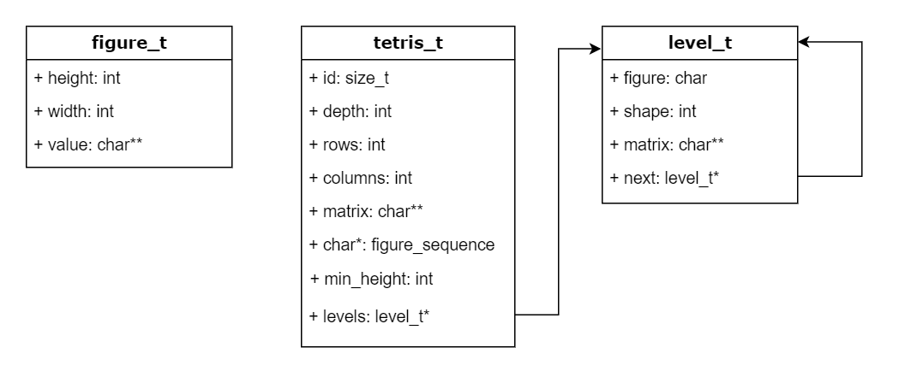
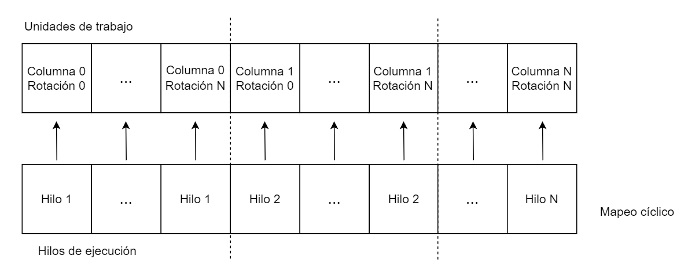

# Diseño
 
## Diagrama de la estructura de datos
El siguiente diagrama UML muestra el diseño de la estructura de datos realizada:



Como se puede apreciar, existen 3 estructuras de datos básicas que representan las figuras, el estado del tetris y una cola para manejar los niveles. La estructura de figuras no se relaciona directamente con el estado del tetris ni con los niveles, pero el estado del tetris sí tiene relación directa con la estructura de niveles mediante un puntero al nivel inicial o base cargado desde el archivo de entrada. Además, la estructura de niveles tiene una relación a sí misma ya que al funcionar como una cola cada nodo (nivel) se relaciona con el nodo que le sigue (siguiente nivel).

Anteriormente, en la Tarea02 existían otras 2 estructuras de datos que eran utilizadas para el manejo de la concurrencia con Pthreads: `shared_data_t` y `private_data_t`, Dichas estructuras fueron eliminadas del código de la Tarea03 ya que al utilizar la tecnología **OpenMP** no son requeridas.


## Diagrama de repartición de trabajo entre hilos
La repartición del trabajo entre los hilos de ejecución se realiza mediante un mapeo cíclico, donde cada hilo efectuará el cálculo de una columna específica y para cada rotación de la primera figura. Cada unidad de trabajo corresponde a una columna del tablero y se recorrerá recursivamente cada posible jugada para calcular el mejor score según la profundidad definida. De forma cíclica, cada hilo tomará la siguiente columna que le corresponde según el tamaño del tablero. Esto se puede lograr fácilmente con el constructo `omp parallel for ... schedule(static, 1)`.

Lo anterior se resume en el siguiente diagrama:




## Descripción general
Esta solución se basa principalmente en la ejecución recursiva de una rutina que intenta encontrar una posición válida donde pueda colocar cada una de las piezas que "van cayendo", según la profundidad dada. Esto se realiza mediante fuerza bruta y a través de un algoritmo de Búsqueda en Profundidad (Depth First Search) que permite colocar todas las piezas de la secuencia en sus diferentes rotaciones y en diferentes posiciones para calcular el puntaje de la jugada en el nivel más abajo (hoja del árbol) con el fin de poder comparar dicho puntaje con el mejor puntaje que se tenga hasta el momento y poder así determinar si una jugada es mejor que la otra. En caso de haber encontrado una mejor jugada, se almacena en memoria la información del nivel bajo la estructura de una cola al insertar el nuevo nodo como un hijo o como el nodo siguiente del nivel actual, esto permite llevar el rastreo o tracking de la pieza colocada en cada nivel. El puntaje de las jugadas está basado en el cálculo de la altura mínima que tiene el tablero del tetris después de colocar una pieza.

Lo anterior es llevado a cabo de forma concurrente por varios hilos de ejecución implementados con la tecnología **OpenMP** que se reparten el trabajo según lo descrito anteriormente y esto permite encontrar más rápido la solución buscada.

De forma general, estos son los pasos que ejecuta el programa principal:
1. Carga los parámetros recibidos y lee el archivo de entrada.
2. Carga el estado inicial del tetris: el identificador, la profundidad, el número de filas, el número de columnas, la matriz inicial, la cantidad de figuras siguientes y la secuencia de figuras.
3. Inicia el conteo del tiempo de ejecución.
4. Mediante OpenMP se crean los hilos de ejecución y se reparten las unidades de trabajo (columnas) de forma cíclica.
5. Inicia la ejecución de cada hilo que toma su unidad de trabajo correspondiente y ejecuta de forma recursiva el algoritmo principal DFS para solucionar el tetris.
6. Espera la finalización de todos los hilos.
7. Genera los archivos resultantes para cada uno de los niveles almacenados en la cola después de la ejecución.
8. Libera toda la memoria correspondiente.
9. Calcula y muestra el tiempo tardado en la ejecución.


## Pseudocódigo
A continuación se muestra el pseudocódigo relacionado a la lógica concurrente:
```
main(argc, argv[]):
    file_name := "./test/Test1.txt"
    shared thread_count = SC_NPROCESSORS_ONLN

    if argc >= 2 then
        file_name := integer(argv[1])      
    end if

    if argc >= 3 then
        file_name := string(argv[1])     
        thread_count := integer(argv[2])    
    end if

    file := open(file_name, "r")
    shared tetris := read_tetris(file)
    
    start_time := omp_get_wtime()
    solve_tetris(tetris, thread_count)
    generate_files(tetris)
    finish_time := omp_get_wtime()

    print("Tiempo de ejecución:  ", start_time - finish_time)

generate_files:
    current := tetris.levels
    while (current != NULL) {
        out_file = open("tetris_play_%i.txt", "w")
        print(out_file, tetris.id)
        print(out_file, current.figure)
        print(out_file, current.rotation)
        print(out_file, tetris.rows)
        print(out_file, tetris.columns)
        print_matrix_file(tetris.rows, current.matrix, out_file);
    end while

solve_tetris(tetris, thread_count):
    num_rotations := get_tetris_figure_num_rotations(tetris.figure_sequence[0])

    #pragma omp parallel for num_threads(thread_count) shared(tetris, num_rotations) schedule(static, 1)
    for col := thread_number to tetris->columns do
        for rotation := 0 to num_rotations do
            figure := get_tetris_figure(tetris.figure_sequence[0], rotation)
            place_figure(tetris, figure, col)

            level = create_level(tetris)
            tetris.levels.next := level

            solve_tetris_dfs(tetris, 1, tetris->levels);

            current_height := calculate_height()
            mutex_lock(can_access_min_height)
            if current_height < tetris.min_height then
                tetris.min_height := current_height
                mutex_lock(can_access_levels)
                tetris.levels := clone_level(tetris)
                mutex_unlock(can_access_levels)
            end if
            mutex_unlock(can_access_min_height)
        end for
    end for
```