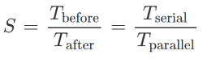
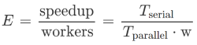
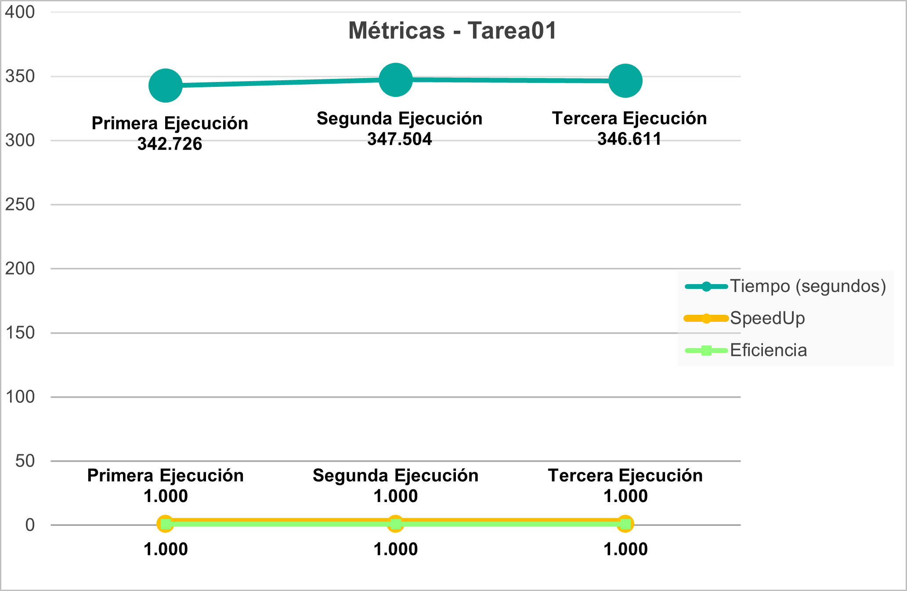
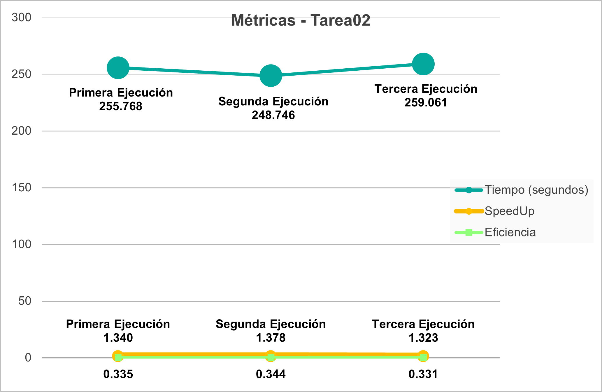
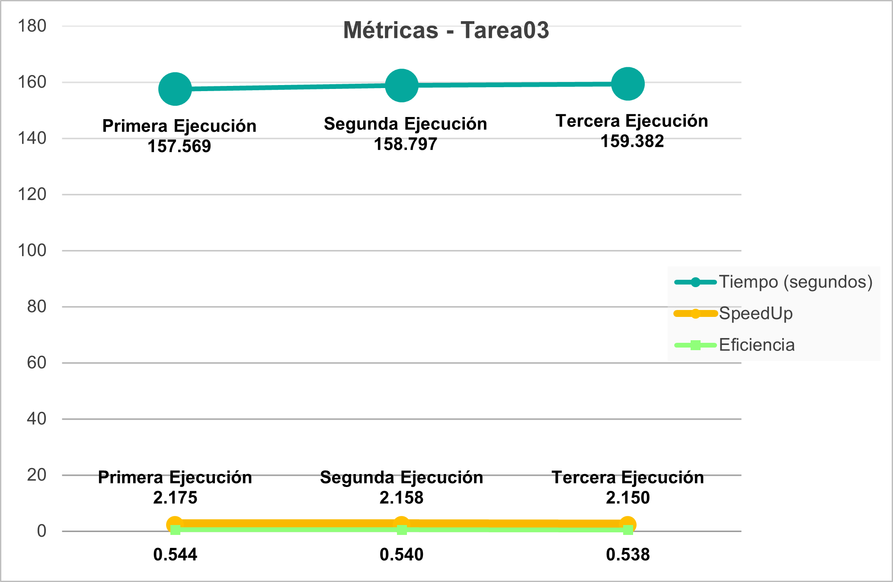

# Documento de reporte
Se realizaron algunas mediciones del tiempo que tarda la [Tarea01](../../tetris_solver_serial/), [Tarea02](../../tetris_solver_pthreads/) y [Tarea03](../../tetris_solver_omp/) en ejecutar la parte más pesada del programa que es el cálculo de las mejores jugadas a través del algoritmo de DFS. Esto con el objetivo de realizar comparaciones entre ellas y ver si se logró mejoras en su rendimiento. Para calcular ese tiempo de ejecución se utilizó en la Tarea01 y Tarea02 la subrutina `clock_gettime` de Pthread, mientras que en la Tarea03 se utilizó la función `omp_get_wtime` de la biblioteca **OpenMP**.

Para realizar esa medición se utilizó el archivo `Test4.txt` que se encuentra en el folder `/test`, el cual corresponde a un estado de tetris inicial con una profundiad de 10, 20 filas y 10 columnas. Con ese archivo la versión serial tarda cerca de 6 minutos ejecutándose, por lo que se considera que es adecuado para usar en las pruebas.

Todas las pruebas se llevaron a cabo en una máquina virtual que cuenta con el Sistema Operativo Debian 11 - 64 bits, posee 4 cores virtuales y 8 GB de Memoria RAM.
 
## Comparación de optimizaciones
Para cada Tarea se efectuaron 3 corridas y en cada una de ellas se capturó la medición del tiempo que duró su ejecución y se registró en la siguiente [hoja de cálculo](./comparacion_optimizaciones.xlsx).

Una vez que se capturaron esos datos, se realizó el cálculo de las siguientes métricas:

* **Speedup *S* (incremento de velocidad)**: se calcula como la relación entre el tiempo que tarda una computación previa a la optimización (*Tbefore*), contra el tiempo que tarda la misma computación posterior a la optimización (*Tafter*). En este caso corresponde al tiempo de ejecución serial (antes) respecto al tiempo de ejecución posterior a la paralización (después).

* **Eficiencia *E***: es una relación entre el incremento de velocidad y la cantidad de trabajadores (*w*) que tuvieron que involucrarse para conseguir el incremento del desempeño.

\
En el caso de la **Tarea01** que implementaba la solución serial se obtuvieron las siguientes métricas:

Como se observa en el gráfico, el tiempo de ejecución en las 3 corridas se mantuvo bastante similar, siendo *347.504 segundos* el más bajo. La métrica speedup y eficiencia se mantienen en *1* ya que al ser la versión serial son los valores base.

\
En el caso de la **Tarea02** donde se incorporó concurrencia con Pthreads se obtuvieron las siguientes métricas al realizar las pruebas con 4 hilos de ejecución (misma cantidad de cores disponibles):

Como se puede observar, el tiempo de ejecución en la primera y tercera corrida fue muy similar pero en la segunda ejecución disminuyó un poco a *248.746 segundos*, siendo este el más bajo. La métrica speedup de la segunda corrida fue *1.378* y su eficiencia de *0.344* al calcularlo con base en la mejor ejecución de la versión serial.

\
Con respecto a la **Tarea03** donde se incorporó concurrencia por medio de la tecnología **OpenMP** se obtuvieron las siguientes métricas al realizar las pruebas con 4 hilos de ejecución (misma cantidad de cores disponibles):

Tal como lo muestra el gráfico, el tiempo de ejecución en las 3 corridas fue casi el mismo, aumentando únicamente *1s* entre cada una. El menor tiempo fue de *157.569 segundos*. La métrica speedup de esa corrida fue *2.175* y su eficiencia de *0.544* al calcularlo con respecto a la mejor ejecución de la versión serial.

\
De las anteriores mediciones se tomó la de menor tiempo de ejecución para cada Tarea y se creó el siguiente gráfico que permite realizar comparaciones con respecto al incremento de desempeño entre las métricas de las Tareas:

Aquí se observa la forma en que el tiempo de ejecución disminuyó de *342.726 segundos* que tardaba en la solución serial de la Tarea01 hacia *248.746 segundos* en la solución concurrente con Pthreads de la Tarea02, hasta llegar a *157.569 segundos* en la ejecución de la Tarea03 con **OpenMP**.

El speedup demuestra un incremento de la velocidad de *1.378 veces* al implementar Pthreads sobre la versión serial y un incremento de *2.175 veces* al utilizar **OpenMP*. Con respecto a la eficiencia, la Tarea02 logró un *34.4%*, mientras que la Tarea03 logró una eficiencia del *54.4%*.

## Comparación de grado de concurrencia

## Nota Adicional

