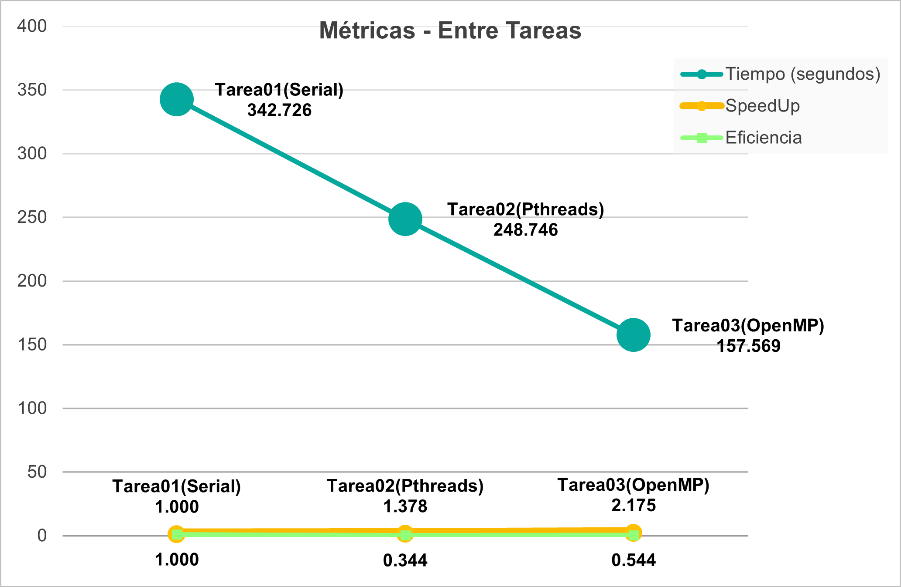
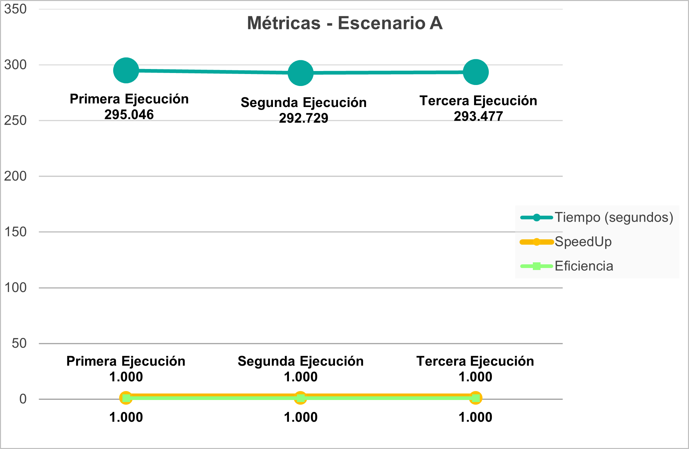

# Documento de reporte
Se realizaron algunas mediciones del tiempo que tarda la [Tarea01](../../tetris_solver_serial/), [Tarea02](../../tetris_solver_pthreads/) y [Tarea03](../../tetris_solver_omp/) en ejecutar la parte más pesada del programa que es el cálculo de las mejores jugadas a través del algoritmo de DFS. Esto con el objetivo de realizar comparaciones entre ellas y ver si se logró mejoras en su rendimiento. Para calcular ese tiempo de ejecución se utilizó en la Tarea01 y Tarea02 la subrutina `clock_gettime` de Pthread, mientras que en la Tarea03 se utilizó la función `omp_get_wtime` de la biblioteca **OpenMP**.

Para realizar esa medición se utilizó el archivo `Test4.txt` que se encuentra en el folder `/test`, el cual corresponde a un estado de tetris inicial con una profundiad de 10, 20 filas y 10 columnas. Con ese archivo la versión serial tarda cerca de 6 minutos ejecutándose, por lo que se considera que es adecuado para usar en las pruebas.

Todas las pruebas se llevaron a cabo en una máquina virtual que cuenta con el Sistema Operativo Debian 11 - 64 bits, posee 4 cores virtuales y 8 GB de Memoria RAM.
 
## Comparación de optimizaciones
Para cada Tarea se efectuaron 3 corridas y en cada una de ellas se capturó la medición del tiempo que duró su ejecución y se registró en la siguiente [hoja de cálculo](./comparacion_optimizaciones.xlsx).

Una vez que se capturaron esos datos, se realizó el cálculo de las siguientes métricas:

* **Speedup *S* (incremento de velocidad)**: se calcula como la relación entre el tiempo que tarda una computación previa a la optimización (*Tbefore*), contra el tiempo que tarda la misma computación posterior a la optimización (*Tafter*). En este caso corresponde al tiempo de ejecución serial (antes) respecto al tiempo de ejecución posterior a la paralización (después).

* **Eficiencia *E***: es una relación entre el incremento de velocidad y la cantidad de trabajadores (*w*) que tuvieron que involucrarse para conseguir el incremento del desempeño.

\
En el caso de la **Tarea01** que implementaba la solución serial se obtuvieron las siguientes métricas:

Como se observa en el gráfico, el tiempo de ejecución en las 3 corridas se mantuvo bastante similar, siendo *347.504 segundos* el más bajo. La métrica speedup y eficiencia se mantienen en *1* ya que al ser la versión serial son los valores base.

\
En el caso de la **Tarea02** donde se incorporó concurrencia con Pthreads se obtuvieron las siguientes métricas al realizar las pruebas con 4 hilos de ejecución (misma cantidad de cores disponibles):

Como se puede observar, el tiempo de ejecución en la primera y tercera corrida fue muy similar pero en la segunda ejecución disminuyó un poco a *248.746 segundos*, siendo este el más bajo. La métrica speedup de la segunda corrida fue *1.378* y su eficiencia de *0.344* al calcularlo con base en la mejor ejecución de la versión serial.

\
Con respecto a la **Tarea03** donde se incorporó concurrencia por medio de la tecnología **OpenMP** se obtuvieron las siguientes métricas al realizar las pruebas con 4 hilos de ejecución (misma cantidad de cores disponibles):

Tal como lo muestra el gráfico, el tiempo de ejecución en las 3 corridas fue casi el mismo, aumentando únicamente *1s* entre cada una. El menor tiempo fue de *157.569 segundos*. La métrica speedup de esa corrida fue *2.175* y su eficiencia de *0.544* al calcularlo con respecto a la mejor ejecución de la versión serial.

\
De las mediciones anteriores se tomó la de menor tiempo de ejecución para cada Tarea y se creó el siguiente gráfico que permite realizar comparaciones con respecto al incremento de desempeño entre las métricas de las Tareas:

Aquí se observa la forma en que el tiempo de ejecución disminuyó de *342.726 segundos* que tardaba en la solución serial de la Tarea01 hacia *248.746 segundos* en la solución concurrente con Pthreads de la Tarea02, hasta llegar a *157.569 segundos* en la ejecución de la Tarea03 con **OpenMP**.

El speedup demuestra un incremento de la velocidad de *1.378 veces* al implementar Pthreads sobre la versión serial y un incremento de *2.175 veces* al utilizar **OpenMP**. Con respecto a la eficiencia, la Tarea02 logró un *34.4%*, mientras que la Tarea03 logró una eficiencia del *54.4%*.

## Comparación de grado de concurrencia
Se realizó otra comparación utilizando diferentes grados de concurrencia (número de hilos). Para esta comparación se utilizó únicamente la solución de la **Tarea03** que hace uso de **OpenMP**.

Al igual que en la sección anterior, todas las mediciones se realizaron en la misma máquina con las características descritas anteriormente y con el mismo archivo de prueba. Para cada escenario se efectuaron 3 corridas y en cada una de ellas se capturó la medición del tiempo que duró su ejecución y se registró en la siguiente [hoja de cálculo](./comparacion_grado_concurrencia.xlsx).

\
Para el **EscenarioA** que correspondía a utilizar un solo hilo (versión serial) se obtuvieron las siguientes métricas:

Como se observa en el gráfico, el tiempo de ejecución en las 3 corridas se mantuvo bastante similar, siendo *292.729 segundos* el más bajo. La métrica speedup y eficiencia se mantienen en *1* ya que al ser la versión serial son los valores base.

\* Nótese que al ejecutar la versión de la Tarea03 de **OpenMP** con un solo hilo se obtuvo un menor tiempo de ejecución que la solución completamente serial de la Tarea01. Esto puede deberse a otro tipo de optimizaciones que se realizaron y que no tienen que ver propiamente con la concurrencia.

\
En el caso del **EscenarioB** se usó un número de hilos igual al número de cores de la máquina donde se ejecutó el programa (en este caso 4 hilos) y se obtuvieron las siguientes métricas:

Como se puede observar, el tiempo de ejecución fue aumentando en cada corrida, por lo que el menor tiempo se logró en la primera y fue de *158.701 segundos*. La métrica speedup fue *1.845* y su eficiencia de *0.461* al calcularlo con base en la mejor ejecución del EscenarioA.

\
Con respecto al **EscenarioC** se utilizó una cantidad de hilos igual a la mitad del número de cores que posee la máquina donde se ejecutó el programa (en este caso 2 hilos) y se obtuvieron las siguientes métricas:

Tal como lo muestra el gráfico, el tiempo de ejecución en la primera y tercera corrida fue casi el mismo, pero en la segunda aumentó *4s*. Por lo tanto, el menor tiempo fue de la primera corrida con *310.147 segundos*. La métrica speedup de esa corrida fue *0.944* y su eficiencia de *0.472* al calcularlo con respecto a la mejor ejecución del EscenarioA.

\
El **EscenarioD** correspondía en utilizar dos hilos por cada core que posea la máquina donde se ejecuta el programa (en este caso 8 hilos) y con esto se obtuvieron las siguientes métricas:

En este caso, el gráfico muestra que la segunda y tercera corrida fueron prácticamente igual, pero el menor tiempo de ejecución se logró en la primera corrida: *45.538 segundos*. Su métrica de speedup fue *6.428* y su eficiencia de *0.804* al calcularlo con base en la mejor ejecución del EscenarioA.

\
El último caso de prueba fue el **EscenarioE** en el cual se usó un número de hilos igual a la cantidad de columnas del tablero de juego multiplicado por el número de rotaciones de la primera figura basándose en el archivo de entrada (en este caso 20 hilos) y se obtuvieron las siguientes métricas:

Como se puede observar, se presentó casi el mismo tiempo de ejecución en la primera y tercera corrida, pero el mismo disminuyó en la segunda corrida a *53.509 segundos*. La métrica speedup fue *5.471* y su eficiencia de *0.274* al calcularlo con base en la mejor ejecución del EscenarioA.

\
De las mediciones anteriores se tomó la de menor tiempo de ejecución para cada Escenario y se creó el siguiente gráfico que permite realizar comparaciones con respecto al grado de concurrencia:

Aquí se observa que en el EscenarioA se obtuvo un tiempo de *292.729 segundos* con un único hilo y después disminuyó a *158.701 segundos* en el EscenarioB con 4 hilos. Al ejecutar el EscenarioC con 2 hilos el tiempo más bien aumentó a *310.147 segundos*, lo cual desmuestra que el hecho de aumentar un hilo a la solución serial no necesariamente significa un incremento en el desempeño. Posteriormente, se ejecutó el EscenarioD con 8 hilos y este duró apenas *45.538 segundos* ejecutándose. Por último, cuando se ejecutó el EscenarioE con 20 hilos el tiempo aumentó un poco a *53.509 segundos*.

El speedup demuestra un incremento en la velocidad de *1.845 veces* entre el EscenarioA (1 hilo) y el EscenarioB (4 hilos). El EscenarioC (2 hilos) presentó un decremento en la velocidad de *0.944 veces*, mientras que en el EscenarioD (8 hilos) se presentó el mayor aumento registrado en la velocidad y corresponde a *6.428 veces*. Finalmente, en el EscenarioE (20 hilos) aunque sí se dio un incremento de *5.471 veces* no fue tan bueno como utilizar únicamente 8 hilos. Lo anterior ejemplifica de muy buena manera que existe un punto óptimo de cantidad de hilos a utilizar y después de ahí, aunque tambień se logra disminuir el tiempo de ejecución con respecto a la solución serial, se está llevando a cabo con muchos más recursos de los requeridos por lo que están siendo desperdiciados.

Ese último punto también se puede confirmar analizando la eficiencia. En el EscenarioD esta métrica fue de un *80.4%* pero para el EscenarioE fue de apenas *27.4%*, lo que significa que éste fue el escenario más ineficiente de todos a pesar de que haya logrado el segundo mejor incremento en la velocidad de ejecución. Por otra parte, el EscenarioC tienen un *1.1%* más de eficiencia que el EscenarioB (*46.1%* y *47.2%* respectivamente) aunque haya tardado casi el doble en el tiempo de ejecución y esto se debe a que logró ese tiempo con la mitad de recursos que el EscenarioB.

De todo lo anterior, se puede concluir que el EscenarioD que utiliza 8 hilos de ejecución (el doble de la cantidad de cores que posee la máquina donde se ejecutaron las pruebas) es el escenario más óptimo para esta solución concurrente.

## Nota Adicional
Durante el desarrollo y pruebas de la solución de la Tarea03 se identificó que a pesar de que la teoría y las mejores prácticas para construir aplicaciones concurrentes recomienden evitar el uso de controles de concurrencia, en algunas ocasiones se vuelve necesario aplicarlos para lograr una mayor optimización en la solución. Por ejemplo, el hecho de implementar un control de concurrencia como lo es un `omp critical` para consultar el mejor score que tiene en cierto momento el estado global del tetris y así evitar continuar a niveles más abajo de profundidad en el algoritmo recursivo, puede significar una disminución enorme en el tiempo de ejecución del programa comparado con las milésimas de segundo que podría tardar esa mínima serialización de un control de concurrencia en este caso.
