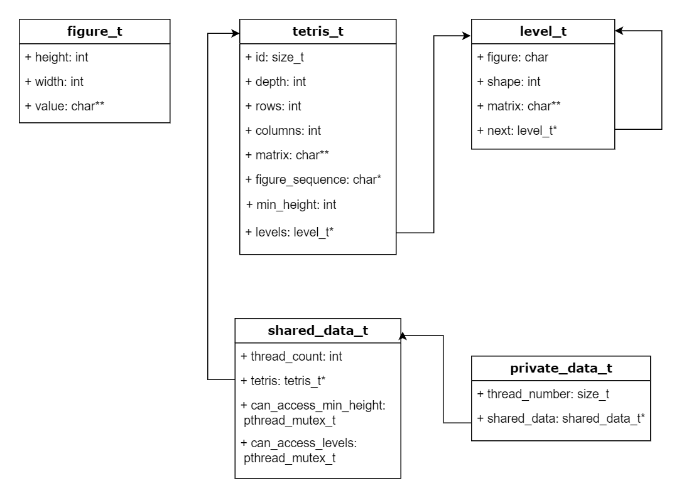

# Diseño
 
## Diagrama de la estructura de datos

El siguiente diagrama UML muestra el diseño de la estructura de datos realizada:



Como se puede apreciar, existen 3 estructuras de datos que representan a una figura, al estado del tetris y a una cola para manejar los niveles. La estructura de figuras no se relaciona directamente con el estado del tetris ni con los niveles, pero el estado del tetris sí tiene relación directa con la estructura de niveles mediante un puntero al nivel inicial o base cargado desde el archivo de entrada. Por otro lado, la estructura de niveles tiene una relación a sí misma ya que al funcionar como una cola cada nodo (nivel) se relaciona con el nodo que le sigue (siguiente nivel).


## Descripción general
Esta solución se basa principalmente en la ejecución recursiva de una rutina que intenta encontrar una posición válida donde pueda colocar cada una de las piezas que "van cayendo", según la profundidad dada. Esto se realiza mediante fuerza bruta y a través de un algoritmo de Búsqueda en Profundidad (Depth First Search) que permite colocar todas las piezas de la secuencia en sus diferentes rotaciones y en diferentes posiciones para calcular el puntaje de la jugada en el nivel más abajo (hoja del árbol) con el fin de poder comparar dicho puntaje con el mejor puntaje que se tenga hasta el momento y poder así determinar si una jugada es mejor que la otra. En caso de haber encontrado una mejor jugada, se almacena en memoria la información del nivel bajo la estructura de una cola al insertar el nuevo nodo como un hijo o como el nodo siguiente del nivel actual, esto permite llevar el rastreo o tracking de la pieza colocada en cada nivel. El puntaje de las jugadas está basado en el cálculo de la altura mínima que tiene el tablero del tetris después de colocar una pieza.

De forma general, estos son los pasos que ejecuta el programa principal:
1. Abre y lee el archivo de entrada.
2. Carga el estado inicial del tetris: el identificador, la profundidad, el número de filas, el número de columnas, la matriz inicial, la cantidad de figuras siguientes y la secuencia de figuras.
3. Crea el nivel inicial o base, como se quiera llamar.
4. Empieza el conteo del tiempo de ejecución.
5. Inicia la ejecución recursiva del algoritmo principal (ver pseudocódigo) para solucionar el tetris.
6. Genera los archivos resultantes para cada uno de los niveles almacenados en la cola después de la ejecución.
7. Libera toda la memoria correspondiente.
8. Calcula y muestra el tiempo tardado en la ejecución.


## Pseudocódigo
A continuación se muestra el pseudocódigo del algoritmo principal utilizado para resolver el problema:
```
Algoritmo Solve_Tetris_DFS (tetris, indice_pieza, nivel_base)
Variables
    entero cant_rotaciones, num_rotacion, num_columna, num_fila, altura_actual
    figura_t figura
    nivel_t nuevo_nivel, nivel_actual

Inicio
    Si indice_pieza = tetris.profundidad + 1 Entonces
        altura_actual -> Obtener_Altura(tetris)
        
        Si altura_actual < tetris.altura_minima Entonces
            tetris.altura_minima <- altura_actual
            Clonar_Nivel(nivel_base, tetris.niveles, tetris.filas, tetris.columnas)
        Fin Si
    Fin Si

    cant_rotaciones <- Obtener_Num_Rotaciones(tetris.secuencia_piezas[indice_pieza])

    Para num_rotacion <- 0 Hasta cant_rotaciones Hacer
        figura <- Obtener_Figura(tetris.secuencia_piezas[indice_pieza], num_rotacion)

        Para num_columna <- 0 Hasta tetris.columnas Hacer
            Si Columna_Valida(tetris, figura, num_columna) Entonces
                num_fila <- Colocar_Figura(tetris, figura, num_columna)

                Si num_fila <> -1 Entonces
                    nuevo_nivel = Crear_Nivel(tetris.secuencia_piezas[indice_pieza], num_rotacion,
                                              tetris.filas, tetris.columnas, tetris.matriz)
                    
                    nivel_actual <- nivel_base
                    Para i <- 0 Hasta indice_pieza Hacer
                        nivel_actual <- nivel_actual.siguiente
                    Fin Para

                    Si nivel_actual.siguiente Entonces
                        Destruir_Niveles(nivel_actual.siguiente, tetris.filas)
                    Fin Si

                    nivel_actual.siguiente <- nuevo_nivel

                    Solve_Tetris_DFS(tetris, indice_pieza + 1, nivel_base)

                    Quitar_Figura (tetris, figura, num_fila, num_columna)
                Fin Si
            Fin Si   
        Fin Para
    Fin Para

Fin Algoritmo
```